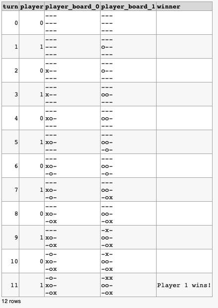

# battleship-sql
Battleship written in sql

This post on Hacker News [TicTacToe in SQL (Postgres)](https://news.ycombinator.com/item?id=18120435) was the first time I had seen a recursive SQL query.

Shortly after that I had a long plane ride and decided to build a game of battleship in SQL using the same approach.

DB Fiddle: https://dbfiddle.uk/?rdbms=postgres_9.6&fiddle=2431f8b518d7c943a0340a3bcffa5d96

TODO:
 - Randomize ship placement

